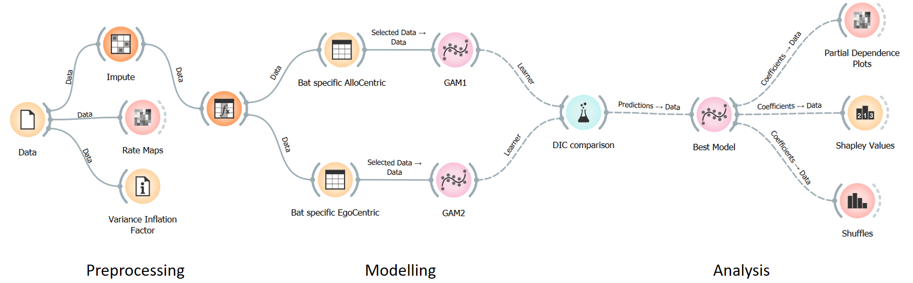

# neural-analysis

Using Generealized Additive Models with neuroscience based priors to explore the relation between high-dimensional enviroments (multiple bats) to neural activity.
Interpretability is accomplished via:
- novel method of dealing with multicollinearity
- PDPs
- Shapley Values
<br> example: 
<br> Code-Flow:  
<hr> <br>
Files and Directories:

```
.
├── inputs/
│   ├── behavior/
│   │   ├── day_1.csv
│   │   ├── ...
│   │   └── day_k.csv
│   ├── cells/
│   │   ├── cell_1_day_1.csv
│   │   ├── ...
│   │   └── cell_n_day_k.csv
│   ├── shuffles/
│   │   ├── cell_1/
│   │   │   ├── shuffle_0.csv
│   │   │   ├── ...
│   │   │   └── shuffle_100.csv
│   │   ├── ...
│   │   └── cell_n/
│   │       └── ...
│   └── subsets/ # These are used for feature-importance (Shapley Values)
│       ├── day_1/
│       │   ├── Allo/
│       │   │   ├── subset_00000000000.csv
│       │   │   ├── ...
│       │   │   └── subset_11111111111.csv
│       │   └── Ego/
│       │       ├── subset_00000000.csv
│       │       ├── ...
│       │       └── subset_11111111.csv
│       ├── ...
│       └── day_k/
│           └── ...
├── notebooks
├── scripts
└── outputs/
    ├── cell_1/
    │   ├── Allo/
    │   │   ├── Shuffles/
    │   │   │   └── <see "output directory" format>
    │   │   └── Subsets/
    │   │       └── <see "output directory" format>
    │   ├── Ego/
    │   │   ├── Shuffles/
    │   │   │   └── <see "output directory" format>
    │   │   └── Subsets/
    │   │       └── <see "output directory" format>
    │   ├── <see "output directory" format>
    │   └── MegaPlot.png # the final plot including insights from the model, shuffles, and subsets
    ├── ...
    └── cell_n/
        └── ...
```

```
<output directory format>:
  ├── plot.png
  ├── stats.json
  ├── partial-plots.csv
  ├── rate-maps.csv
  └── model.pkl # pickle file
```

<!--
inputs
  behavior
    day_1.csv
    ...
    day_k.csv
  cells
    cell_1_day_1.csv
    ...
    cell_n_day_k.csv
  shuffles
    cell_1
      shuffle_0.csv
      ...
      shuffle_100.csv
    ...
    cell_n
      ...
  subsets
    day_1
      Allo
        subset_00000000000.csv
        ...
        subset_11111111111.csv
      Ego
        subset_00000000.csv
        ...
        subset_11111111.csv
    day_k
      ...
notebooks
scripts
outputs
  cell_1
    Allo
      Shuffles
        <see "output directory" format>
      Shapley
        <see "output directory" format>
    Ego
      Shuffles
        <see "output directory" format>
      Shapley
        <see "output directory" format>
    MegaPlot
  ...
  cell_n
    ...
-->