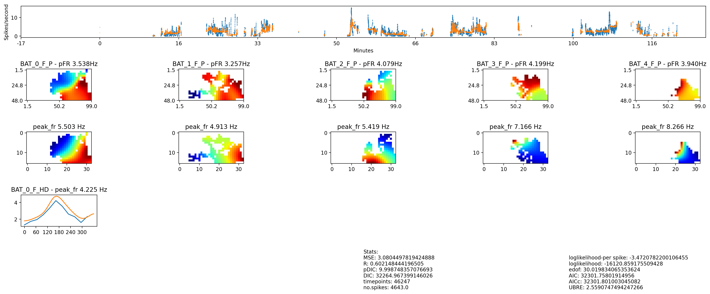

# neural-analysis

Using Generealized Additive Models with neuroscience based priors to explore the relation between high-dimensional enviroments (multiple bats) to neural activity.
Interpretability is accomplished via:
- novel method of dealing with multicollinearity
- PDPs
- Shapley Values
  example: 

 Code-Flow: 

  
Files and Directories:

.
 ├── inputs/
 │   ├── behavior/
 │   │   ├── day_1.csv
 │   │   ├── ...
 │   │   └── day_k.csv
 │   ├── cells/
 │   │   ├── cell_1_day_1.csv
 │   │   ├── ...
 │   │   └── cell_n_day_k.csv
 │   ├── shuffles/
 │   │   ├── cell_1/
 │   │   │   ├── shuffle_0.csv
 │   │   │   ├── ...
 │   │   │   └── shuffle_100.csv
 │   │   ├── ...
 │   │   └── cell_n/
 │   │       └── ...
 │   └── subsets/
 │       ├── day_1/
 │       │   ├── Allo/
 │       │   │   ├── subset_00000000000.csv
 │       │   │   ├── ...
 │       │   │   └── subset_11111111111.csv
 │       │   └── Ego/
 │       │       ├── subset_00000000.csv
 │       │       ├── ...
 │       │       └── subset_11111111.csv
 │       └── day_k/
 │           └── ...
 ├── notebooks
 ├── scripts
 └── outputs/
     ├── cell_1/
     │   ├── Allo/
     │   │   ├── Shuffles/
     │   │   │   └── <see "output directory" format>
     │   │   └── Shapley/
     │   │       └── <see "output directory" format>
     │   ├── Ego/
     │   │   ├── Shuffles/
     │   │   │   └── <see "output directory" format>
     │   │   └── Shapley/
     │   │       └── <see "output directory" format>
     │   └── MegaPlot
     ├── ...
     └── cell_n/
         └── ...

<!--
inputs
  behavior
    day_1.csv
    ...
    day_k.csv
  cells
    cell_1_day_1.csv
    ...
    cell_n_day_k.csv
  shuffles
    cell_1
      shuffle_0.csv
      ...
      shuffle_100.csv
    ...
    cell_n
      ...
  subsets
    day_1
      Allo
        subset_00000000000.csv
        ...
        subset_11111111111.csv
      Ego
        subset_00000000.csv
        ...
        subset_11111111.csv
    day_k
      ...
notebooks
scripts
outputs
  cell_1
    Allo
      Shuffles
        <see "output directory" format>
      Shapley
        <see "output directory" format>
    Ego
      Shuffles
        <see "output directory" format>
      Shapley
        <see "output directory" format>
    MegaPlot
  ...
  cell_n
    ...
-->